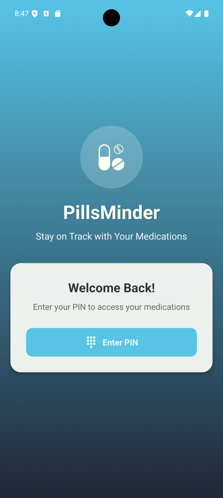
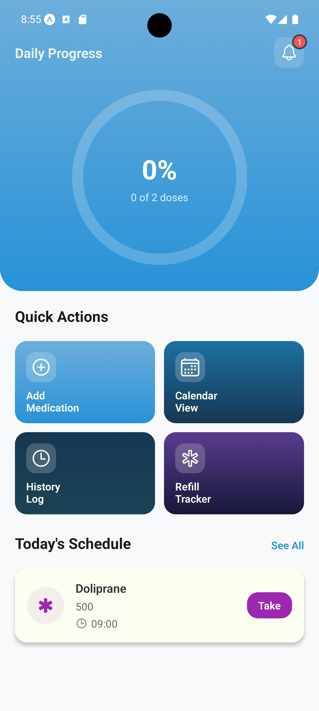
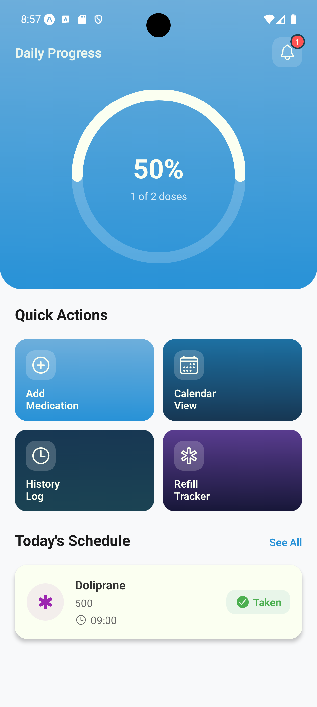
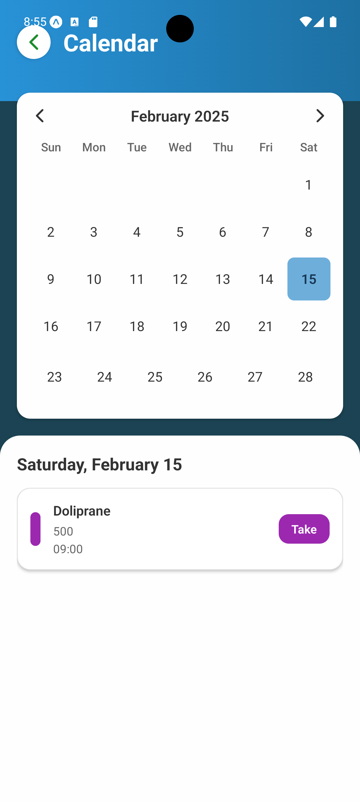
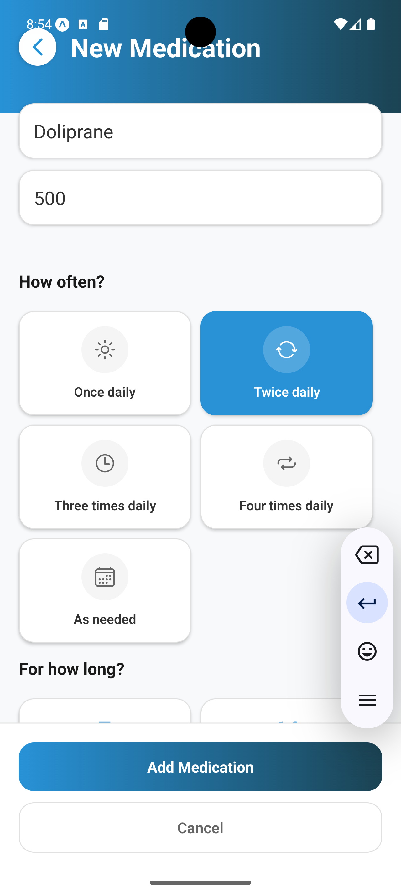
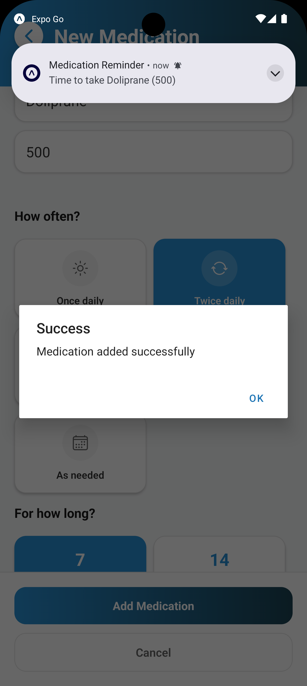
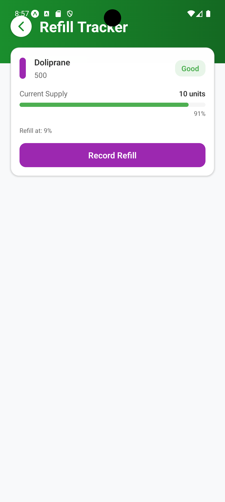
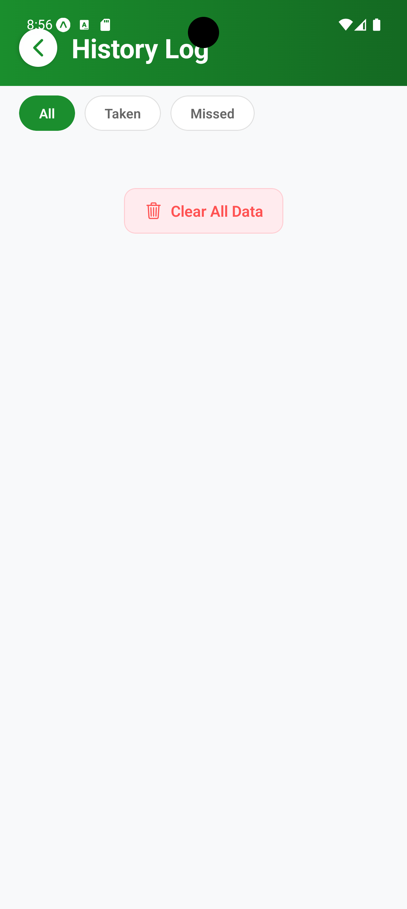

<h1>PillsMinder App Project</h1>

PillsMinder is a comprehensive medication management app designed to help users stay on top of their medication schedules effortlessly. 
With PillsMinder, managing your medications becomes a breeze, giving you peace of mind and better health management.

<h1></h1>
<h1>PillsMinder Key Features include</h1>

•	Push Notifications: Receive timely reminders for each medication dose, ensuring you never miss a pill. 
•	Biometric Authentication: Secure access to your medication data with code fingerprint or facial recognition. 
•	Pills Minder: Easily track your pill intake history, including dosage and timing. 
• Calendar integration for dose management 
• Daily progress visualization 
• Secure local data storage with AsyncStorage 
•	Medication Interaction Alerts: Get notified if there are potential interactions between different medications. 
•	Refill Reminders: Automatic reminders for prescription refills and upcoming medical appointments. 
•	Data Sharing: Share medication information with caregivers or healthcare providers securely. 

<h1></h1>
<h1>PillsMinder Screen</h1>

This section would allow users to easily navigate through different screen, helping them find exactly what they're looking for in the app based on their needs. 

<h1></h1>
   
   <h1></h1>
   
   <h1></h1>
   
   <h1></h1>
  
  <h1></h1>
  
  <h1></h1>
  
  <h1></h1>
  

<picture>
  <source media="(prefers-color-scheme: dark)" srcset="https://raw.githubusercontent.com/tobiasmeyhoefer/tobiasmeyhoefer/output/github-snake-dark.svg" />
  <source media="(prefers-color-scheme: light)" srcset="https://raw.githubusercontent.com/tobiasmeyhoefer/tobiasmeyhoefer/output/github-snake.svg" />
  
</picture>
